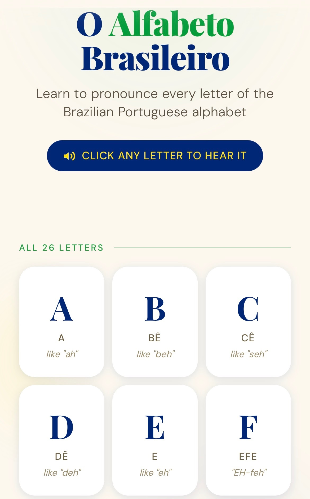

 

# Make an Alphabet Soundboard in 5-Minutes! 

If you or your group have any questions or get stuck as you work through this in-class exercise, please ask the instructor for assistance.  Have fun!

Step 1
{: .label .label-step}
- If you haven’t already, please go to [the TinkerCad website and create an account](http://tinkercad.com){:target="_blank"} for yourself.
- If you find yourself in a tutorial, click on the Tinkercad logo in the top left of the screen to exit to the home page.
{: .step}

Step 2
{: .label .label-step}
- Click **Create new design**. If the TinkerCad tutorial pane is up on the right-hand side, you will need to get out of it before proceeding.
- Click on the TinkerCad logo at the top to bring you back to your main page.
- From there you should see the “Create new design” button. 
{: .step}

Step 3
{: .label .label-step}
- On the right side of the TinkerCad open a drop-down menu by clicking on **Basic Shapes**, and then select the **Design Starters** option, then the **"A" Letter Icon**. 
This will display a list of 3D letters that you can scroll down through to find the whole alphabet, plus numbers 1 through 9. 
{: .step}

Step 4
{: .label .label-step}
- Drag and drop all the individual letters from a name or word you want to use onto the workplane. 
{: .step}

Step 5
{: .label .label-step}
- Select all the letters and then click on the **Align Button**.
{: .step}

Step 6
{: .label .label-step}
- Now move the letter closer together so that they overlap a significant amount so that when your keychain is printed it will stay together when some stress is put on it. See my example below:
{: .step}

Step 7
{: .label .label-step}
- To make the lettering a bit more interesting we are going to raise every other letter by 2mm from the current 4mm. To start doing this click on the first letter, and then
  - Click on the **white dot** near the middle of the letter (which will then turn red).
  - Click on the **4.00** and change the number to “6” and then press the enter key, and the first letter will stand higher than all the rest. Raise every second letter so that your name looks something similar to this:
{: .step}

  

    
Show/Hide Animation

     
  

[NEXT STEP: Cellphone Keychain Stand](2-keychain-stand.html){: .btn .btn-blue }
