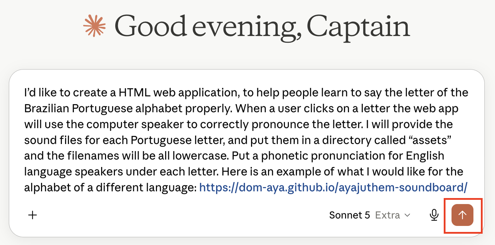
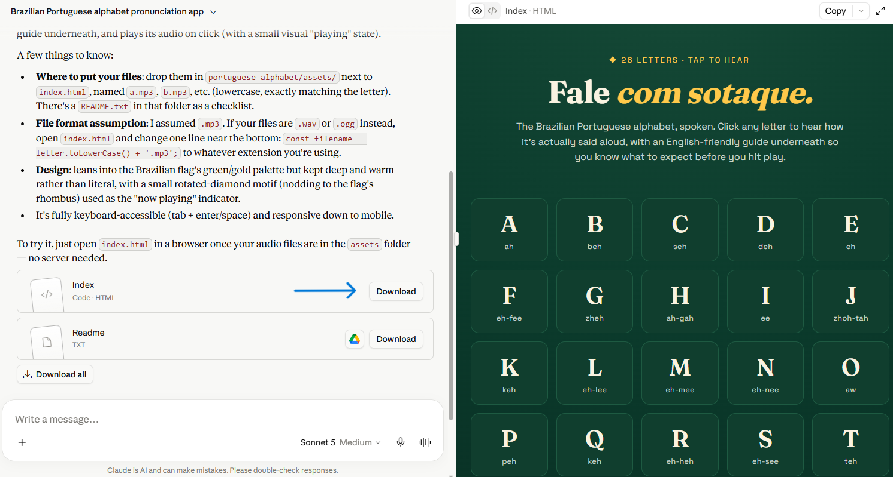

# Make an Alphabet Soundboard in 5-Minutes! 
 

Sound boards can be very helpful for people learning a new laguages begin to learn the sounds of letters at their own pace with as much or as little repitition as needed. Here's an example of a soundboard app crated for Language Revitalization purposes: [LiK'wala Soundboard for language learners](https://richmccue.github.io/likwala/likwala-soundboard.html){:target="_blank"}.

Feel free to create a soundboard for any language you want during this activity. That said, the audio files the activity are for a Portuguese alphabet soundboard, so if you choose to create a soundboard for a different languge, you can use the Portugues files as places holders until you are able record audio files for the language you choose.  

If you get stuck, please ask your instructor for assistance, and don't forget to have fun!

Step 1
{: .label .label-step}
- You can use any Generative AI tool for this activity, but for coding I'd recommend using Anthropic's [Claude](https://claude.ai/){:target="_blank"}, as the free version creates more visually attractive web applications by default. Alternatively, you can use [Google Gemini](https://gemini.google.com/){:target="_blank"} (which comes free with Gmail), [ChatGPT](https://chatgpt.com/){:target="_blank"}, [Microsoft Copilot](https://copilot.microsoft.com/){:target="_blank"}, or any other GenAI tool that you are familiar with.
  

{: .step}

Step 2
{: .label .label-step}
- Copy and paste the following prompt into your GenAI tool (feel free to change the language of course) and then press **Enter** on your keyboard: <br>
```text
I’d like to create a HTML web application, to help people learn to say the letter of the
Brazilian Portuguese alphabet properly. When a user clicks on a letter the web app will
use the computer speaker to correctly pronounce the letter. I will provide the sound
files for each Portuguese letter, and put them in a directory called “assets” and the
filenames will be all lowercase. Put a phonetic pronunciation for English language
speakers under each letter. Here is an example of what I would like for the alphabet of a
different language: https://dom-aya.github.io/ayajuthem-soundboard/
```

{: .step}

Step 3
{: .label .label-step}
- Next we need to wait a minute or two for the AI to read the web page and create the HTML file for you. While it works, you can watch it write the code.
- If you are using Claude, it will display a preview of the webpage on the right side of the screen once it generates the file. Before downloading, you can review the preview and provide additional prompts if you would like to make any changes
- Once it’s finished, click the Download button and make note of where you saved the file on your laptop (usually your Downloads folder).

{: .step}

Step 4
{: .label .label-step}
- Download the zip file that contains all the MP3 audio files for each Portuguese letter to the same folder where you downloaded the HTML file Claude created for you:
  - Download the Portuguese audio for each letter in the zip file called: [assets.zip](assets/assets.zip)
  - Find the assets.zip file on your laptop and unzip it. On a Mac you simply **double-click** on the file and it will unzip. On Windows you **right mouse click** on the file and select **Extract All…** 
{: .step}

Step 5
{: .label .label-step}
- Now that you have the audio files folder in the same place as the HTML file you downloaded, you can open the mp3 audio files in your file manager by **double clicking** on the sound files, and the sounds for each of the letters should play back to you.
{: .step}

Step 6
{: .label .label-step}
- If you created your Soundboard in Claude, [it should look something like this](https://richmccue.github.io/brasil-letters/portuguese.html){:target="_blank"}.
- Your soundboard should be playing the sounds for letters in the Portugues alphabet now. If you are having any problems, please let your instructor know and they help you get your soundboard up and running!
{: .step}

Step 7
{: .label .label-step}
- If you are creating a soundboard for a language like Hul'q'umi'num, that has letters in it's alphabet with non-English accents like glottal stops, you should follow up with a prompt like this (depending on the types of accents used in the language):
{: .step}
```text
Change the letter mapping to the letter files with the letters that have a glottal stop so
that for example the c' file name is: c_glottal.mp3
```

Step 8
{: .label .label-step}

- **Optional:** Share your soundboard with the world by publishing it for free on GitHub Pages. If you have a GitHub account:
  * Create a new public repository and upload your HTML file (you will have to rename the file to index.html)
  * In the repository, go to **Settings**, then **Pages**, and under **Branch** select **main**, then click **Save**
  * After a minute or two your game will be live at `https://your-username.github.io/your-repository/your-game.html`
- If you'd like a walkthrough of this process, ask your instructor or your GenAI tool for step-by-step GitHub Pages publishing instructions.

Here's an example of how to upload a file on GitHub:
    <button onclick="toggle('gif1')">Show/Hide Animation</button>
    <div id="gif1">
    
    </div>

<script>  
    function toggle(input) {
        var x = document.getElementById(input);
        if (x.style.display === "none") {
            x.style.display = "block";
        } else {
            x.style.display = "none";
        }
    }
</script>

---

Congratulations on completing this Alphabet Soundboard vibe code project! Here's an example of a soundboard app crated for Language Revitalization purposes: [LiK'wala Soundboard for language learners](https://richmccue.github.io/likwala/likwala-soundboard.html){:target="_blank"}.

[NEXT STEP: Eco Runner](2-eco-runner.html){: .btn .btn-blue }
