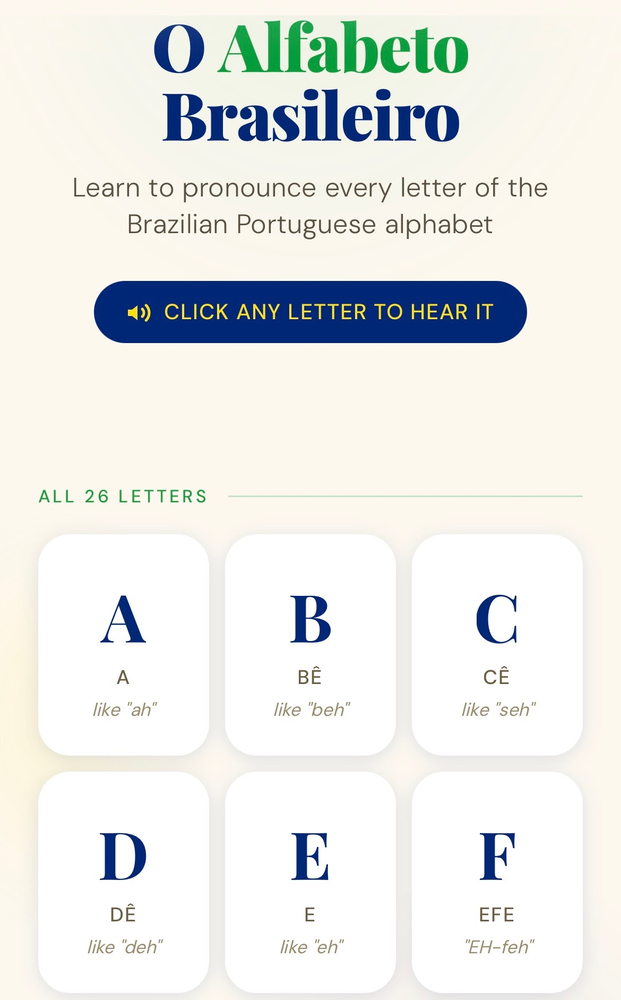
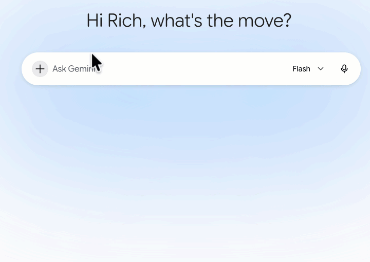
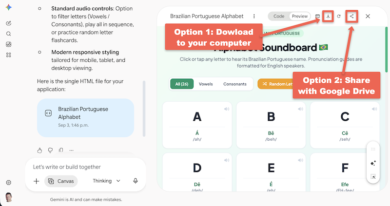

# Make an Alphabet Soundboard in 5-Minutes!



Soundboards can be very helpful for people learning a new language to begin learning the sounds of letters at their own pace, with as much or as little repetition as needed. Here's an example of a soundboard app created for language revitalization purposes: [LiK'wala Soundboard for language learners](https://richmccue.github.io/likwala/likwala-soundboard.html){:target="\_blank"}.

Feel free to create a soundboard for any language you want during this activity. That said, the audio files for the activity are for a Portuguese alphabet soundboard, so if you choose to create a soundboard for a different language, you can use the Portuguese files as placeholders until you are able to record audio files for the language you choose.

If you get stuck, please ask your instructor for assistance, and don't forget to have fun!

Step 1
{: .label .label-step}

- You can use any Generative AI tool for this activity, but we recommend using [Google Gemini](https://gemini.google.com/){:target="\_blank"} for this activity, which comes free with Gmail.
- Alternatively, you can use other GenAI tools like Anthropic's [Claude](https://claude.ai/){:target="\_blank"}, [ChatGPT](https://chatgpt.com/){:target="\_blank"}, or [Microsoft Copilot](https://copilot.microsoft.com/){:target="\_blank"}.
  {: .step}

Step 2
{: .label .label-step}

- Select the **+** button on the left side of the chat box, and then select **Canvas** (look at the animation below if you're unsure where the buttons are located).
- Select the drop-down menu on the right side of the chat box that says **Flash**, and then select **Extended Thinking**.
- Copy and paste the following prompt into your GenAI tool (feel free to change the language, of course) and then press **Enter** on your keyboard: <br>

```text
I'd like to create an HTML web application to help people learn to say the letters of the Brazilian Portuguese alphabet properly. When a user clicks on a letter, the web app will use the computer speaker to correctly pronounce the letter. I will provide the sound files for each Portuguese letter and put them in a directory called "assets," and the filenames will be all lowercase. Put a phonetic pronunciation for English-language speakers under each letter. Here is an example of what I would like for the alphabet of a different language: https://dom-aya.github.io/ayajuthem-soundboard/
```

<button onclick="toggle('gif2')">Show/Hide Animation</button>

<div id="gif2">
  
</div>
{: .step}

Step 3
{: .label .label-step}

- Next, we need to wait a minute or two for the AI to read the web page and create the HTML file for you. While it works, you can watch it write the code.
- If you are using Gemini, it will display a preview of the webpage on the right side of the screen once it generates the file. Before downloading, you can review the preview and provide additional prompts if you would like to make any changes.
- Once it's finished, you have two options:
  1. Click the **Download** button and make note of where you saved the file on your laptop (usually your Downloads folder).
  2. Click on the **Share** button and then share your new web app via Google Drive, either with specific people or by making your app viewable by anyone in the world.
     
     {: .step}

Step 4
{: .label .label-step}

- Download the zip file that contains all the MP3 audio files for each Portuguese letter to the same folder where you downloaded the HTML file **[your GenAI tool]** created for you:
  - Download the Portuguese audio for each letter in the zip file called: [assets.zip](assets/assets.zip)
  - Find the **assets.zip** file on your laptop and unzip it. On a **Mac**, you simply **double-click** on the file, and it will unzip. On **Windows**, you **right-click** on the file and select **Extract All…**
    {: .step}

Step 5
{: .label .label-step}

- Now that you have the audio files folder in the same place as the HTML file you downloaded, you can open the MP3 audio files in your file manager by **double-clicking** on the sound files, and the sounds for each of the letters should play back to you.
  {: .step}

Step 6
{: .label .label-step}

- If you created your soundboard, [it should look something like this](https://richmccue.github.io/brasil-letters/portuguese.html){:target="\_blank"}.
- Your soundboard should be playing the sounds for the letters in the Portuguese alphabet now. If you are having any problems, it's probably related to where you unzipped the assets.zip file, which should be in the same directory as your soundboard file. Please let your instructor know, and they will help you get your soundboard fully up and running!
  {: .step}

Step 7 - OPTIONAL
{: .label .label-step}

- If you are creating a soundboard for a language like Hul'q'umi'num that has letters in its alphabet with non-English accents like glottal stops, you should follow up with a prompt like this (depending on the types of accents used in the language):
  {: .step}

```text
Change the letter mapping to the letter files with the letters that have a glottal stop, so that, for example, the c' file name is: c_glottal.mp3
```

Step 8 - OPTIONAL
{: .label .label-step}

- **Optional:** Another way to share your soundboard with the world is by publishing it for free on GitHub Pages.
  - If you don't have a GitHub account, go to Github and [create an account](https://github.com/signup){:target="\_blank"}.
  - Create a new public repository and upload your HTML file (you will have to rename the file to index.html).
    - In the repository, go to **Settings**, then **Pages**, and under **Branch**， select **Main**, then click **Save**. Here's a [video](https://www.youtube.com/watch?v=DqjPr7auwdY){:target="\_blank"} that walks you through this process.
    <iframe width="650" height="420" src="https://www.youtube.com/embed/DqjPr7auwdY" title="Enabling GitHub Pages" frameborder="0" allow="accelerometer; autoplay; clipboard-write; encrypted-media; gyroscope; picture-in-picture" allowfullscreen></iframe>
  - After a minute or two, your soundboard will be live at `https://your-username.github.io/your-repository/your-game.html`
- If you'd like a walkthrough of this process, ask your instructor or your GenAI tool for step-by-step GitHub Pages publishing instructions.
- Here is an example of how to publish your file:

  <button onclick="toggle('gif1')">Show/Hide Animation</button>
    <div id="gif1">
    
    </div>

{: .step}

---

Congratulations on completing this **Alphabet Soundboard** vibe code project! Here's an example of a soundboard app created for language revitalization purposes: [LiK'wala Soundboard for language learners](https://richmccue.github.io/likwala/likwala-soundboard.html){:target="\_blank"}.

<script>  
    function toggle(input) {
        var x = document.getElementById(input);
        if (x.style.display === "none") {
            x.style.display = "block";
        } else {
            x.style.display = "none";
        }
    }
</script>

[NEXT STEP: Eco Runner](2-eco-runner.html){: .btn .btn-blue }
