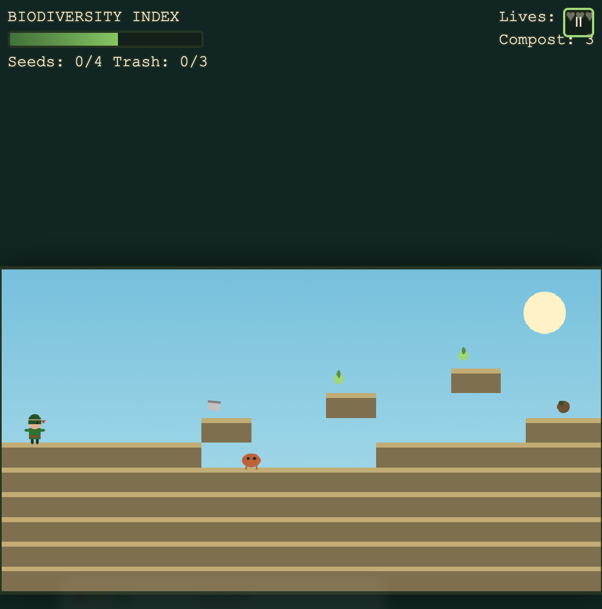
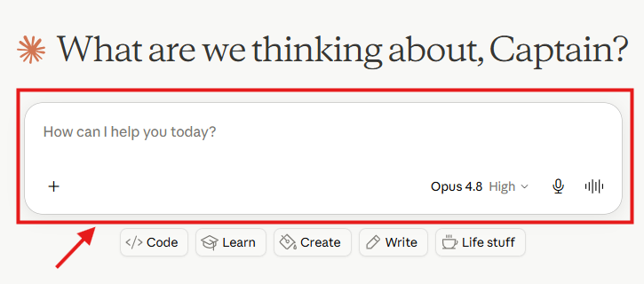

# !!!UNDER CONSTRUCTION!!!
# Make an Eco-Runner Game! 


Classic platformer games like Super Mario are a fantastic way to learn how games teach through play: running, jumping, collecting items, and avoiding hazards. In this activity you will use a Generative AI tool to "vibe code" your own side-scrolling platformer with an environmental restoration theme. Instead of stomping goombas and collecting coins, your hero might capture invasive species, clean up pollution, plant native trees, and restore a damaged ecosystem back to health.

Here is an example of a finished game created with this approach: [Salish Sea Guardian - A Restoration Adventure](https://richmccue.github.io/learning-games/salish-sea-guardian.html). In that game a young forest guardian restores five wounded corners of the Salish Sea coast by capturing invasive species, neutralizing pollution, reviving dying trees, and bringing the Biodiversity Index back to life.

Feel free to set your game in any ecosystem you like: a local watershed, a coral reef, a prairie grassland, a boreal forest, or somewhere else that matters to you. If you get stuck, please ask your instructor for assistance, and don't forget to have fun!

---

Step 1
{: .label .label-step}
- You can use any Generative AI tool for this activity, but for coding I'd recommend using Anthropic's [Claude](https://claude.ai/){:target="_blank"}, as the free version creates more visually attractive web applications by default. Alternatively, you can use [Google Gemini](https://gemini.google.com/){:target="_blank"} (which comes free with Gmail), [ChatGPT](https://chatgpt.com/){:target="_blank"}, [Microsoft Copilot](https://copilot.microsoft.com/){:target="_blank"}, or any other GenAI tool that you are familiar with.
{: .step}



Step 2
{: .label .label-step}
- Before prompting, take two minutes to plan your game's environmental theme. Jot down quick answers to these questions on paper or in a text file:
  * **Ecosystem:** Where does your game take place? (e.g. a west coast shoreline, a wetland, a coral reef)
  * **Hero:** Who is the player? (e.g. a park ranger, a young guardian, a river otter)
  * **Enemies or hazards:** What environmental threats will the player face? (e.g. invasive green crabs, oil slicks, litter, smog clouds)
  * **Collectibles:** What does the player gather instead of coins? (e.g. native seeds, pieces of trash to recycle, clean water droplets)
  * **Goal:** How does the player win a level? (e.g. restore the Biodiversity Index to 100%, replant all the trees)
 {: .step}

Step 3
{: .label .label-step}
- Copy and paste the following prompt into your GenAI tool, replace the parts in [square brackets] with your own theme ideas from Step 2, and then press **Enter** on your keyboard:

```
I'd like to create a single-file HTML web application: a side-scrolling platformer
game in the style of Super Mario, but with an environmental restoration theme.
The game is set in [your ecosystem], and the player is [your hero]. Instead of
enemies like goombas, the player captures or avoids [your environmental hazards,
e.g. invasive species and pollution]. Instead of coins, the player collects
[your collectibles, e.g. native seeds and pieces of trash]. The player wins each
level by [your goal, e.g. restoring a Biodiversity Index meter to full].

Please include:
- Keyboard controls (arrow keys to move, spacebar to jump) AND on-screen touch
  controls so the game works on phones and tablets
- At least 3 levels that get progressively harder
- A lives system and a score display
- A title screen with a "How to Play" section
- Cheerful graphics drawn with code (no external image files needed) so the game
  works as one self-contained HTML file

Here is an example of the style of game I'm hoping for:
https://richmccue.github.io/learning-games/salish-sea-guardian.html

Before you start coding, please ask me any clarifying questions that would help
you build a better game.
```


{: .step}

Step 4
{: .label .label-step}

- Your GenAI tool will likely ask you one or two clarifying questions before it starts coding, such as what art style you prefer or how difficult the game should be. Answer the questions briefly in the chat, then press **Enter**. Short answers are fine; you can always refine things later.


{: .step}

Step 5
{: .label .label-step}

- Now wait a minute or two while the AI writes the code for your game. In Claude, the game will appear in a preview window (called an Artifact) beside the chat. Once the code is finished, try playing your game right in the preview:
  * Use the **arrow keys** to run left and right
  * Press the **spacebar** to jump
  * Try landing on top of a hazard or collecting one of your collectibles to make sure the score changes


{: .step}

Step 6
{: .label .label-step}
- No first draft is perfect, and this is where vibe coding shines: just tell the AI what to change in plain English. Try one or two follow-up prompts like these, pressing **Enter** after each one and re-testing the game:

```
The jump feels too floaty. Make the jump a bit shorter and snappier.
```

```
Add a short educational fact about [your ecosystem] that pops up each time the
player finishes a level.
```

```
Add simple sound effects for jumping, collecting items, and completing a level,
generated in code with the Web Audio API so no sound files are needed.
```


{: .step}

Step 7
{: .label .label-step}
- When you are happy with your game, download it so you have your own copy:
  * In Claude, click the **Download** button at the top of the Artifact preview and make note of where you saved the HTML file on your laptop.
  * Find the file in your file manager and **double-click** it. It should open in your web browser and play exactly the same as it did in the preview, even without an internet connection.


{: .step}

Step 8
{: .label .label-step}
- Test your game on a phone or tablet if you have one handy. Because you asked for touch controls in the original prompt, you should see on-screen buttons for moving and jumping. If something doesn't work well on mobile, describe the problem to the AI, for example:

```
On my phone the jump button is partly hidden behind the score display. Please
move the touch controls so nothing overlaps, and make the buttons a bit bigger.
```


{: .step}

Step 9
{: .label .label-step}

- **Optional:** Share your game with the world by publishing it for free on GitHub Pages. If you have a GitHub account:
  * Create a new public repository and upload your HTML file
  * In the repository, go to **Settings**, then **Pages**, and under **Branch** select **main**, then click **Save**
  * After a minute or two your game will be live at `https://your-username.github.io/your-repository/your-game.html`
- If you'd like a walkthrough of this process, ask your instructor or your GenAI tool for step-by-step GitHub Pages publishing instructions.


{: .step}

---

Congratulations on completing this environmental platformer vibe code project! You now have a playable game that teaches players about protecting and restoring the ecosystem you chose. Here's the example that inspired this activity: [Salish Sea Guardian - A Restoration Adventure](https://richmccue.github.io/learning-games/salish-sea-guardian.html).

**Ideas for going further:**
- Add a fourth and fifth level set in a new part of your ecosystem
- Add a "boss" hazard at the end of the final level, such as a large oil spill that takes several actions to clean up
- Ask the AI to add a two-player mode or a level timer with a high-score table

---

## Appendix: Screenshot capture guide

Each step above references one image in the `images/` folder. Capture and annotate them as follows (arrows and callout boxes can be added with macOS Preview, Windows Snipping Tool, or a tool like Skitch):

| Filename | What to capture | Annotations |
|---|---|---|
| `images/eco-platformer-logo.jpg` | A fun banner image or a screenshot of a finished game title screen | None (decorative) |
| `images/step-1-choose-genai-tool.png` | Claude or Gemini home page | Arrow to the prompt box |
| `images/step-2-plan-your-theme.png` | A notes file with the five planning questions answered | Callouts on ecosystem and collectibles |
| `images/step-3-paste-prompt.png` | The full prompt pasted into the chat | Arrows to the [square bracket] sections and the send button |
| `images/step-4-answer-questions.png` | The AI's clarifying questions plus a short reply | Callout box around the questions |
| `images/step-5-play-preview.png` | The game running in the Artifact preview | Arrows to score, lives, and player character |
| `images/step-6-iterate.png` | A follow-up prompt and the resulting change | Before/after callout |
| `images/step-7-download.png` | The Artifact Download button and the file open in a browser | Arrow to Download button |
| `images/step-8-mobile-test.png` | The game on a phone screen | Circles around the touch controls |
| `images/step-9-github-pages.png` | GitHub Pages settings screen | Arrows to Branch dropdown and Save; highlight the live URL |

[NEXT STEP: Language Defender](3-language-defender.html){: .btn .btn-blue }
