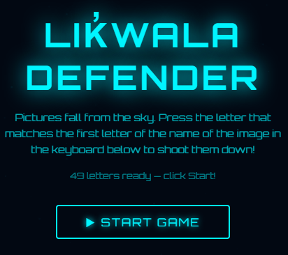
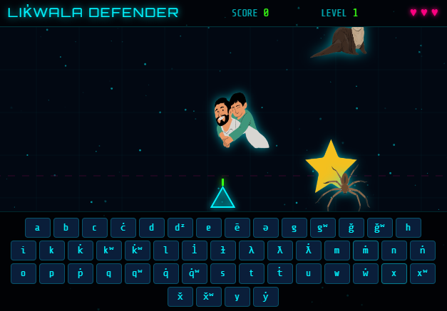

 

# Make a Language Defender Game!

Games can be a powerful way to help language learners spend more time on task, and arcade-style games in particular encourage the kind of rapid letter and sound recognition that helps new alphabets stick. In this activity you will create a Missile Command style game where pictures fall from the sky, and players must press the letter that matches the first letter of the word for each falling image to shoot it down before it reaches the ground. Here's an example of a finished game created for Language Revitalization purposes: [Lik̓wala Defender](https://richmccue.github.io/likwala/likwala-defender.html).

Feel free to create a Language Defender game for any language you want during this activity. If you completed the [Alphabet Sound Board](1-soundboard.html) activity, you can reuse the same language, audio files, and letter list here, which will make several steps go faster.

If you get stuck, please ask your instructor for assistance, and don't forget to have fun!

## Planning with some GenAI assistance

Step 1
{: .label .label-step}
- You can use any Generative AI tool for this activity, but for coding I'd recommend using Anthropic's [Claude](https://claude.ai/).
{: .step}

Step 2
{: .label .label-step}
- Before we ask the AI to write any code, let's use it as a thinking partner to explore how classic arcade game mechanics could support language learning. Copy and paste the following prompt into your GenAI tool and press **Enter** on your keyboard:

```
How could I adapt the game mechanics of the classic arcade game Missile Command to help
people learn the alphabet of a language they are studying? The player should have to
recognize the first letter of the word for an image in order to defend against it.
Please suggest 4-5 game mechanics, and note which ones would work well for beginners
versus more advanced learners.
```

{: .step}

Step 3
{: .label .label-step}
- Read through the suggestions and pick two or three mechanics you like. There are no wrong answers here! In the example game, the mechanics chosen were: falling pictures, an on-screen keyboard for shooting, lives that are lost when a picture reaches the ground, and levels that gradually speed up.
{: .step}

## Building the game

Step 4
{: .label .label-step}
- Now we're ready to build. Copy and paste the following prompt into the **same conversation** (so the AI remembers the planning discussion), change the language and letter list to match the language you are working with, and press **Enter**:

```
Please create a single-file HTML web game called "Language Defender" inspired by
Missile Command, to help people learn the Lik̓wala alphabet. Here is how it should work:

1. Pictures of animals and everyday objects slowly fall from the top of the screen.
2. An on-screen keyboard at the bottom of the screen shows every letter of the alphabet,
   including letters with special characters like glottal stops.
3. The player must click or tap the letter that matches the FIRST letter of the word for
   the falling image. A correct press fires a missile that destroys the picture.
4. The player starts with 3 lives (shown as hearts). If a picture reaches the ground,
   the player loses a life.
5. Show the score and current level at the top. Each level makes pictures fall a
   little faster.
6. Include a start screen with simple instructions, and a game over screen with the
   final score and a "Play Again" button.
7. The image files will be in a folder called "images" and named after the word they
   show, in all lowercase (for example: bear.png, salmon.png, canoe.png). Please include
   a list in the code where I can easily map each image filename to the word and its
   first letter.
8. The game must work with both a physical keyboard and touch on mobile devices.
9. Please make it a single self-contained HTML file so I can host it on GitHub Pages.
```

{: .step}

Step 5
{: .label .label-step}

- Next we need to wait a minute or two for Claude to create the HTML file for you. Once you see the **Download** button, click on it and make note of where you saved it on your laptop.


{: .step}

## Adding your images

Step 6
{: .label .label-step}

- The game needs pictures to shoot down! Create a folder called **images** in the same folder where you downloaded the HTML file, then either:
  * Download the sample image pack for this activity: [defender-images.zip](assets/defender-images.zip), unzip it, and move the images into your **images** folder, or
  * Add your own pictures. Name each file after the word it shows, in all lowercase (for example: `bear.png`). Simple, clear pictures with plain backgrounds work best for a fast-moving game.
- On a Mac you simply **double-click** on the zip file and it will unzip. On Windows you **right mouse click** on the file and select **Extract All...**


{: .step}

Step 7
{: .label .label-step}

- **Double-click** the HTML file to open it in your web browser and click **START GAME**. Pictures should begin falling, and pressing the matching first letter on the on-screen keyboard (or your physical keyboard) should shoot them down.  
- If images show up as broken icons, the most common cause is a filename mismatch. Ask your AI tool to print the list of image filenames it expects, and rename your files to match, or paste your actual filenames into the chat and ask it to update the code. 
{: .step}

## Making it your own

Step 8
{: .label .label-step}

- Now the fun part: iterating! Vibe coding works best when you make one change at a time, test it, and then ask for the next change. Here are some follow-up prompts to try, one at a time:

```
Please add three difficulty modes to the start screen: Beginner (slow falling speed,
common letters only), Intermediate, and Advanced (fast, full alphabet including
letters with glottal stops).
```

```
When the player shoots down a picture, please play the audio pronunciation of the word.
The audio files are in a folder called "assets" and are named after the word in all
lowercase, for example: bear.mp3
```

```
Please add a mastery system that tracks which letters the player gets right and wrong,
and shows falling pictures for the letters they struggle with more often. Save the
player's progress in the browser using localStorage so it persists between sessions.
```


{: .step}

Step 9
{: .label .label-step}

- If your language uses special characters such as glottal stops, test every one of those letters on the on-screen keyboard. If a letter doesn't fire correctly, follow up with a prompt like this:

```
The letter k̓ on the on-screen keyboard is not registering correctly. Please make sure
each on-screen key is matched to its word list entry directly, rather than comparing
keyboard input characters, so letters with combining accent marks work reliably.
```

## Sharing your game

Step 10
{: .label .label-step}

- To share your game with others, you can publish it for free using GitHub Pages: upload your HTML file and your **images** (and **assets**) folders to a GitHub repository and turn on GitHub Pages in the repository settings. Your instructor can help you with this, and the process is the same one used to publish the [example game](https://richmccue.github.io/likwala/likwala-defender.html).


{: .step}

Step 11
{: .label .label-step}

- An important note if you are building this game for a language revitalization project: before sharing your game publicly, please verify all spellings, words, and audio recordings with community language keepers or Elders. Generative AI tools frequently make mistakes with Indigenous language orthographies, and getting community review isn't just about accuracy: it's about respecting the community's authority over their own language.
{: .step}

Congratulations on completing this Language Defender vibe code project! You've now used generative AI for planning, building, iterating, and debugging, which is the complete vibe coding workflow.

[NEXT STEP: Quiz Game](4-quiz-game.html)
