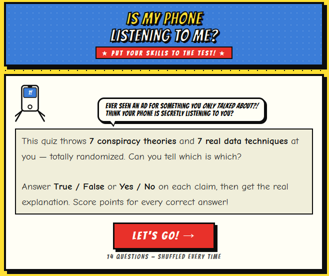
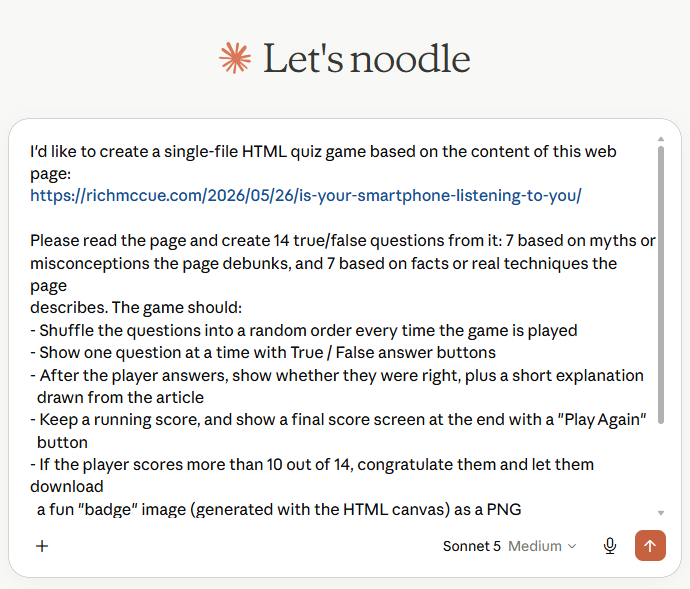

---
layout: default
title: 4-Quiz-Game
nav_order: 6
parent: Workshop Activities
customjs: http://code.jquery.com/jquery-1.4.2.min.js
---

 
 
# Make a "Fact or Fiction" Quiz Game in 10 Minutes!
 
Quiz games are a fun way to help learners test their knowledge and separate myths from reality. In this activity you will use a Generative AI tool to build a true/false quiz game from a web page of your choosing. Here is an example of a finished quiz built this way: [Is My Phone Listening To Me? Quiz](https://richmccue.github.io/learning-games/phone_listening_quiz.html), which was created from this blog post: [Is Your Smartphone Listening to You?](https://richmccue.com/2026/05/26/is-your-smartphone-listening-to-you/).
 
**Important:** For this activity we strongly encourage you to choose a web page on a topic you know well, rather than using the sample blog post above. Why? Because Generative AI tools sometimes get facts wrong or oversimplify them, and if you know the topic, you can fact check the quiz questions in real time as you build your game. This is a great habit to develop whenever you use AI to create educational content!
 
If you get stuck, please ask your instructor for assistance, and don't forget to have fun!
 
## Step 1
 
- You can use any Generative AI tool for this activity, but for coding I'd recommend using either [Google Gemini](https://gemini.google.com/) (which comes free with Gmail), or [Claude](https://claude.ai/), as the free version of Claude currently does as good a job as Google's Gemini, and creates more visually attractive web applications by default.
 
## Step 2
 
- Find a web page on a topic you know well and copy its web address (URL) from your browser's address bar. Good candidates include a blog post you've written, a Wikipedia article on your favourite hobby, or an article from your field of study.
- If you can't think of one, you can use the sample article for this activity: [Is Your Smartphone Listening to You?](https://richmccue.com/2026/05/26/is-your-smartphone-listening-to-you/) — but remember, using a page you know well means you can spot any errors the AI makes.
 
## Step 3
 
- Copy and paste the following prompt into your GenAI tool, replace the URL with the web page you chose in Step 2, and then press **Enter** on your keyboard:  
  
```
I'd like to create a single-file HTML quiz game based on the content of this web page:
https://richmccue.com/2026/05/26/is-your-smartphone-listening-to-you/
 
Please read the page and create 14 true/false questions from it: 7 based on myths or
misconceptions the page debunks, and 7 based on facts or real techniques the page
describes. The game should:
- Shuffle the questions into a random order every time the game is played
- Show one question at a time with True / False answer buttons
- After the player answers, show whether they were right, plus a short explanation
  drawn from the article
- Keep a running score, and show a final score screen at the end with a "Play Again"
  button
- If the player scores more than 10 out of 14, congratulate them and let them download
  a fun "badge" image (generated with the HTML canvas) as a PNG
- Have a fun, colourful retro arcade visual style
- Work well on both phones and laptops
- Be a single self-contained HTML file with no external dependencies, so it can be
  hosted on GitHub Pages
```
 
## Step 4
 
- Next we need to wait a minute or two for the AI to read the web page and create the HTML file for you. While it works, you can watch it write the code.
- Once it's finished, click the **Download** button and make note of where you saved the file on your laptop (usually your **Downloads** folder).

 
 
## Step 5
 
- Find the HTML file you just downloaded and **double-click** on it to open it in your web browser.
- Click through a few questions to make sure the game works: the questions should be shuffled, the True/False buttons should respond, and your score should update.
 
## Step 6
 
- **Now for the most important step: fact checking!** Open your source web page in one browser tab and your quiz in another. Play through the entire quiz and check every question and explanation against the original article:
  * Is each "fact" question actually supported by the article?
  * Are the "myth" questions really presented as myths in the article?
  * Are the explanations accurate, or has the AI added details that aren't in the source?
- If you find a question that is wrong or misleading, go back to your AI chat and ask it to fix that specific question. For example:
```
Question about [topic] is not accurate. The article actually says [what the article
says]. Please correct that question and its explanation, and give me the updated file.
```
 
## Step 7
 
- Once your questions are accurate, you can customize your game with follow-up prompts. Try one or more of these, or invent your own:
  
```
Change the visual theme to a Pacific Northwest colour palette with ocean blues and
forest greens.
```
 
```
Add a 15 second countdown timer to each question, and award bonus points for fast
correct answers.
```
 
```
Add sound effects using the Web Audio API: a happy chime for correct answers and a
gentle buzz for incorrect ones, with a mute button.
```
 
- After each change, **download the new file, open it in your browser, and re-test it**, including a quick re-check that the questions are still accurate. Small, incremental changes are much easier to test and fix than one giant request.
 
## Step 8 (Optional)
 
- If you'd like to share your quiz with the world, you can host it for free on [GitHub Pages](https://pages.github.com/). If you completed the GitHub Pages activity earlier in this workshop, upload your HTML file to your repository and it will be live at your GitHub Pages address in a minute or two.
- If you haven't set up GitHub Pages yet, ask your instructor or see the Additional Resources page for a guide.

<!-- Screenshot to capture: the GitHub repo file view with the quiz HTML file uploaded. Annotate with a red box around the file name and a callout showing the resulting public URL. -->
 
Congratulations on completing this Quiz Game vibe code project! You've not only built a working game, you've also practised one of the most important skills for working with Generative AI: verifying its output against a trusted source. Here's the finished example again for inspiration: [Is My Phone Listening To Me? Quiz](https://richmccue.github.io/learning-games/phone_listening_quiz.html).

[NEXT STEP: ??????](3-????.html){: .btn .btn-blue }
