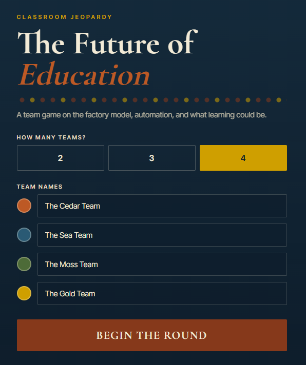

# !!!UNDER CONSTRUCTION!!!
# Make a Classroom Jeopardy Game in 10-Minutes!
 

Jeopardy-style review games are a fun and effective way to help students review course material in teams. In this activity you will use a Generative AI tool to "vibe code" a classroom Jeopardy game based on the content of a web page, complete with team scoring, Daily Doubles, and a Final Jeopardy round. Here is an example of a finished game: [Classroom Jeopardy - The Future of Education](https://richmccue.github.io/learning-games/jeopardy.html){:target="_blank"}.

For this activity we will use this blog post as the source of the questions and answers: [Is Your Smartphone Listening to You?](https://richmccue.com/2026/05/26/is-your-smartphone-listening-to-you/){:target="_blank"}. That said, **we strongly encourage you to find a web page or [Wikipedia article](https://en.wikipedia.org/wiki/Main_Page){:target="_blank"} on a topic you know well**, because Generative AI tools sometimes make mistakes when writing questions and answers, and you will be able to fact check the game content in real time as you play through it.

If you get stuck, please ask your instructor for assistance, and don't forget to have fun!

Step 1
{: .label .label-step}
- You can use any Generative AI tool for this activity, but for coding I'd recommend using Anthropic's [Claude](https://claude.ai/){:target="_blank"}, as the free version creates more visually attractive web applications by default. Alternatively, you can use [Google Gemini](https://gemini.google.com/){:target="_blank"} (which comes free with Gmail), [ChatGPT](https://chatgpt.com/){:target="_blank"}, [Microsoft Copilot](https://copilot.microsoft.com/){:target="_blank"}, or any other GenAI tool that you are familiar with.


<!-- Screenshot to capture: Claude.ai (or Gemini) start screen, with an arrow or box annotation pointing to the prompt input field -->
{: .step}

Step 2
{: .label .label-step}
- Copy and paste the following prompt into your GenAI tool, replacing the web page link with a page on a topic you know well if you prefer, and then press **Enter** on your keyboard:

```
I'd like to create a classroom Jeopardy game as a single self-contained HTML file that I
can host on GitHub Pages. Please base all of the questions and answers on the content of
this web page: https://richmccue.com/2026/05/26/is-your-smartphone-listening-to-you/

The game should include:
- A setup screen where I can choose 2, 3, or 4 teams and enter team names
- A game board with 5 categories and 5 clues per category, with point values from 100 to 500
- Clues written as answers, with teams responding in the form of a question, just like
  real Jeopardy
- One or two hidden Daily Doubles where the team that finds it can wager points
- A button to reveal the correct response after each clue, and buttons to award points to
  the team that answered correctly (or to no team)
- A Final Jeopardy round where each team secretly wagers up to their current score before
  seeing the final clue
- A champion screen at the end showing the winning team and final scores
Here is an example of the look and feel I'm going for:
https://richmccue.github.io/learning-games/jeopardy.html
```


<!-- Screenshot to capture: the full prompt pasted into the chat box, ready to submit; annotate the Enter/send button -->
{: .step}

Step 3
{: .label .label-step}
- Next we need to wait a minute or two for the GenAI tool to create the HTML file for you. In Claude you will see the game being built in a preview window on the right-hand side of the screen as the code is written.


<!-- Screenshot to capture: Claude mid-generation, with annotations pointing to the code/preview toggle and the preview pane -->
{: .step}

Step 4
{: .label .label-step}
- Once the game is finished, play a quick round directly in the preview window. **This is the most important step**: because you chose a web page you know well, check each question and answer against the source page as you reveal them. GenAI tools sometimes invent plausible-sounding but incorrect answers, so open the source web page in another browser tab and verify anything that looks even slightly off.


<!-- Screenshot to capture: the generated game board next to the source blog post in a second window; annotate one clue and the matching passage in the source -->
{: .step}

Step 5
{: .label .label-step}
- If you find a question or answer that is incorrect, or you'd like to adjust the game, simply tell the GenAI tool what to change in a follow-up prompt. For example:

```
The 300 point clue in the second category has an incorrect answer. According to the source
web page, the correct answer is [the correct answer]. Please fix that clue, and also
rename the third category to something shorter.
```


<!-- Screenshot to capture: a follow-up prompt in the chat with the updated preview; annotate the changed clue or category -->
{: .step}

Step 6
{: .label .label-step}
- When you are happy with the game, click on the **Download** button to save the HTML file to your laptop, and make note of where you saved it.


<!-- Screenshot to capture: the artifact preview with an arrow annotation pointing to the Download button -->
{: .step}

Step 7
{: .label .label-step}
- Find the HTML file you just downloaded in your file manager and **double-click** on it to open it in your web browser. Set up two teams, give them fun names, and play through a few clues, a Daily Double, and Final Jeopardy to make sure everything works, including the scoring.


<!-- Screenshot to capture: the game running from the local file, with annotations on the team score display and a revealed clue -->
{: .step}

Step 8 (Optional)
{: .label .label-step}
- Want to make the game your own? Try follow-up prompts like these to customize the look and feel, or to make the game reusable with other content:

```
Change the colour scheme to my school's colours: [your colours here], and add a fun sound
effect when a Daily Double is revealed.
```

```
Now create a second version of the game using the content from this web page instead:
[link to another web page you know well]
```


<!-- Screenshot to capture: the restyled game board; annotate the changed colours or new feature -->
{: .step}

Congratulations on completing this Classroom Jeopardy vibe code project! If you'd like to share your game with students or colleagues, ask your instructor about hosting it for free on [GitHub Pages](https://pages.github.com/){:target="_blank"}, just like the example game: [Classroom Jeopardy - The Future of Education](https://richmccue.github.io/learning-games/jeopardy.html){:target="_blank"}.

[NEXT STEP: Workout Tracker](6-workout-tracking.html){: .btn .btn-blue }
