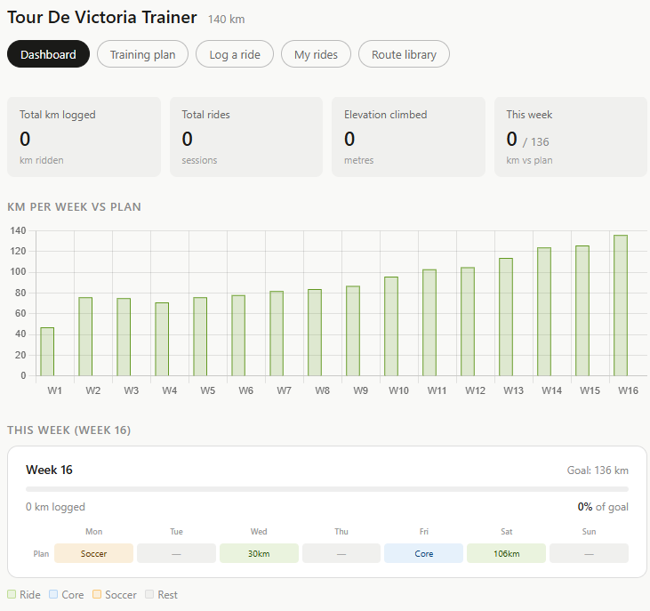
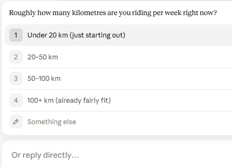
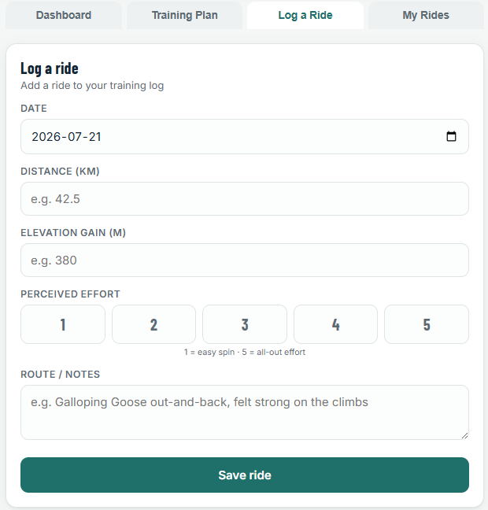

 

# Make a Workout Training Tracker in About 15 Minutes!

Training for a race or fitness event is much easier when you can see your progress. A simple training tracker app lets you log your workouts, compare your weekly totals against a training plan, and stay motivated as race day approaches. Here's an example of a training tracker app created to prepare for a 140 km bicycle race: [Tour de Victoria Training Tracker](https://richmccue.github.io/tdv/local.html).

Feel free to create a tracker for any sport or fitness event you want during this activity, for example a 10K run, a triathlon, a multi-day hike, or a swimming event. That said, the sample prompt below is set up for bicycle race training, so if you choose a different sport you can simply tell the GenAI tool about your event when it asks you clarifying questions.

If you get stuck, please ask your instructor for assistance, and don't forget to have fun!

Step 1
{: .label .label-step}
- You can use any Generative AI tool for this activity, but for coding I'd recommend using either [Google Gemini](https://gemini.google.com/) (which comes free with Gmail), or [Claude](https://claude.ai/), as the free version of Claude currently does as good a job as Google's Gemini, and creates more visually attractive web applications by default.
{: .step}

Step 2
{: .label .label-step}
- Copy and paste the following prompt into your GenAI tool (feel free to change the race, distances, or dates of course) and then press **Enter** on your keyboard:

```
I'd like to create a self-contained, single-file HTML web application to help me train
for a bicycle race. The app should run entirely in the web browser and save my data in
the browser's localStorage so my rides are not lost when I close the page.

The race I am training for is the Tour de Victoria, a 140 km ride on August 10, 2026.
Please include:
- A dashboard with a chart comparing kilometres ridden per week against a suggested
  weekly training plan
- A training plan tab that gradually builds up my weekly distance between now and
  race day
- A "Log a ride" form with fields for date, distance (km), elevation gain (m),
  perceived effort (1 to 5), and route/notes
- A "My rides" tab that lists all of my logged rides, with the ability to edit or
  delete each one
- A clean, mobile-friendly design that works well on a phone

Before you write any code, please ask me any clarifying questions that would help you
build a better app for me. For example, you might ask about my current fitness level,
how many days per week I can train, or whether I'd rather train for a different sport
or event, such as a 10K run, a triathlon, or a long-distance hike.
```
{: .step}

Step 3
{: .label .label-step}

- Because we asked it to, the GenAI tool should now ask you a few clarifying questions before it starts coding. Answer the questions in the chat box. For example: 

```
I can train 4 days a week, I'm currently comfortable riding about 40 km, and yes,
please keep it as a bicycle race tracker. Please start the training plan from next
Monday.
```

- If you'd rather train for a different sport or event, this is the moment to say so! For example: "Actually, I'd like to train for a 10K run on October 4th instead. Please change distances to kilometres run and remove the elevation gain field." 

{: .step}

Step 4
{: .label .label-step}
- Next we need to wait a minute or two while the GenAI tool creates the HTML file for you. In Claude the app will appear in a preview pane on the right side of the screen, and you can try it out right away.
- Once it's finished, click the **Download** button and make note of where you saved the HTML file on your laptop.
 
{: .step}


Step 5
{: .label .label-step}
- Find the HTML file you just downloaded and **double-click** on it to open it in your web browser.
- Try logging a ride (or run, or swim!): click on the **Log a ride** tab, fill in the date, distance, elevation gain, perceived effort, and a short note about your route, then click **Save ride**.
 
{: .step}

Step 6
{: .label .label-step}
- Now click on the **Dashboard** tab. You should see your ride appear on the chart comparing your kilometres per week against the training plan.
- Log two or three more rides with different dates and distances so you can see the chart come to life.
- Close the browser tab and open the HTML file again. Your rides should still be there, because they are saved in your browser's localStorage.

{: .step}

Step 7
{: .label .label-step}

- If you created your tracker in Claude, [it should look something like this](https://richmccue.github.io/tdv/local.html).
- Now it's time to make the app your own. Try one or two follow-up prompts like these:

```
Please add a "Route library" tab where I can save my favourite routes with their
distance and elevation gain, and filter them by maximum distance.
```

```
Please add a countdown on the dashboard showing how many days and weeks are left
until race day.
```

```
The training plan increases too quickly for me. Please make the weekly distance
increase by no more than 10% per week.
```

Step 8 (Optional)
{: .label .label-step}

- If you'd like to use your tracker on your phone or share it with a friend or teammates, you can publish it for free with GitHub Pages:
  * Create a free account at [github.com](https://github.com/) if you don't already have one.
  * Create a new **public** repository, for example one called "training-tracker".
  * Upload your HTML file to the repository and rename it **index.html**.
  * In your repository go to **Settings**, then **Pages**, and under **Branch** select **main** and click **Save**.
  * After a minute or two your app will be live at: https://YOUR-USERNAME.github.io/training-tracker/
- Note: with this simple version, your data is saved separately in each browser you use, because localStorage lives on each device. If you'd like your rides to sync between your phone and laptop, see the **Optional Activity: Sync Your Data with GitHub** section below.


{: .step}

---

# Optional Activity: Sync Your Data with GitHub

By default your tracker saves data in your browser's localStorage, which means your rides only exist on the device where you logged them. In this optional activity you'll modify your app so it saves your training data to a file in a GitHub repository instead. That way you can log a ride on your phone and see it on your laptop, just like the [Tour de Victoria Training Tracker](https://richmccue.github.io/tdv/local.html) does.

> **Important privacy warning: your training data will be publicly available on the internet.**
> This activity stores your data in the same **public** GitHub repository that hosts your app, so every ride you log, including dates, distances, and any notes you write, can be viewed by **anyone in the world**. Do not enter anything you want to keep private, such as your home address, the exact start and end points of your rides, or personal health details. If you would not post it on social media, do not put it in this app.

Optional Step 1
{: .label .label-step}

- First you need a GitHub Personal Access Token (PAT), which lets your app write data to your repository:
  * Go to [github.com/settings/tokens/new](https://github.com/settings/tokens/new)
  * Give it a name like "Training Tracker"
  * Set the expiration to 1 year
  * Under **Scopes**, check **repo**
  * Click **Generate token**, and copy the token somewhere safe. You will only be shown it once!
- Treat your token like a password and never share it with anyone. Anyone with your token can make changes to your repositories.


{: .step}

Optional Step 2
{: .label .label-step}

- Go back to your GenAI tool conversation and paste in the following prompt:

```
Please modify my training tracker so that instead of saving my data only in
localStorage, it saves my training data as a JSON file in my GitHub repository using
the GitHub API. When the app opens it should ask me once for my GitHub username,
repository name, branch, and a Personal Access Token, and save those details in
localStorage on my device so I don't have to enter them again. Every time I add,
edit, or delete a ride, the app should update the JSON file in my repository. Please
also show a clear warning in the app that any data saved to a public repository is
visible to anyone on the internet.
```

{: .step}

Optional Step 3
{: .label .label-step}

- Download the updated HTML file, upload it to your repository as **index.html** (replacing the old one), and open your GitHub Pages URL.
- Enter your GitHub username, repository name, branch (usually "main"), and paste in your Personal Access Token, then click **Connect**.
- Your token is only saved in your own browser's localStorage on that device, and it is only ever sent to GitHub's API.


{: .step}

Optional Step 4
{: .label .label-step}

- Log a ride, then open your repository on github.com. You should see a new JSON file containing your training data, and a new commit each time you save a ride.
- Now open your app on a different device (like your phone), enter the same connection details, and your rides should appear there too!
- Remember: that JSON file, and everything in it, is publicly visible to anyone who visits your repository. You can delete individual rides in the app, or delete the JSON file from your repository, at any time.


{: .step}

---

Congratulations on completing this Training Tracker vibe code project! Whether you're getting ready for a century ride, a first 5K, or a summer of hiking, you now have a personalized app to keep you on track. Here's the example that inspired this activity: [Tour de Victoria Training Tracker](https://richmccue.github.io/tdv/local.html).

Copyright © 2026 [UVic Libraries Digital Scholarship Commons](https://uvic.ca/library/dsc/) - <dscommons@uvic.ca>
View other [DSC workshops](https://lib.uvic.ca/curric)
Distributed by a [Creative Commons Attribution 4.0 International License.](http://creativecommons.org/licenses/by/4.0/)

[NEXT STEP: ??????](3-????.html){: .btn .btn-blue }
