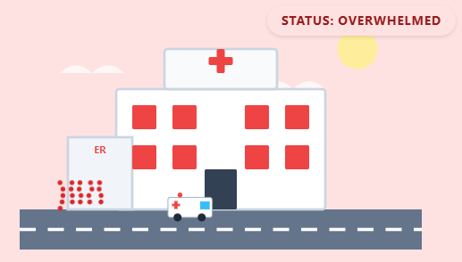

# !!!UNDER CONSTRUCTION!!!
# Make an Hospital Capacity Simulator App! 
 

Hospital simulations are commonly used to help healthcare professionals and students understand how decisions about staffing, patient volume, and available resources affect hospital operations. In this activity, you will use a Generative AI tool to "vibe code" your own Hospital Capacity Simulator. By adjusting factors such as incoming patients, healthcare workers, hospital beds, and emergency room capacity, you'll explore how different situations can impact a hospital's ability to provide care.

Here's an example of a Hospital Capacity Simulator created with this approach using Claude: [Hospital Capacity Simulator](https://mahumahmed.github.io/hospital-capacity-simulator/){:target="_blank"}. 

And here's an example using Google Gemini: [Hospital Capacity Simulator](https://richmccue.github.io/learning-games/salish-sea-guardian.html){:target="_blank"}. 


You can use any Generative AI tool for this activity, but for coding I'd recommend using Anthropic's [Claude](https://claude.ai/){:target="_blank"}, as the free version creates more visually attractive web applications by default. Alternatively, you can use [Google Gemini](https://gemini.google.com/){:target="_blank"} (which comes free with Gmail), [ChatGPT](https://chatgpt.com/){:target="_blank"}, [Microsoft Copilot](https://copilot.microsoft.com/){:target="_blank"}, or any other GenAI tool that you are familiar with.

If you get stuck, please ask your instructor for assistance, and don't forget to have fun!

## Planning with some GenAI assistance

Step 1
{: .label .label-step}
- Before prompting, take two minutes to plan your hospital simulation. Jot down quick answers to these questions on paper or in a text file::
  
  * **Hospital Type:** What kind of hospital are you managing?
    (e.g. large city hospital, small rural clinic, children's hospital, emergency trauma centre)

  * **Main Challenge:** What situation is your hospital trying to manage?
    (e.g. flu season, staffing shortages, unexpected increase in patients, local emergency)
    
  * **Events:** What unexpected events could impact your hospital?
    (e.g. seasonal illness, heat wave, holiday weekend, disease outbreak)
    
  * **Goal:** What does success look like in your simulation?
    (e.g. keep wait times low, avoid overcrowding, maintain high patient satisfaction, use resources efficiently)
    
  * **Visual Style:** How would you like your simulator to look?
    (e.g. cartoon hospital, realistic dashboard, game-like interface)
{: .step}

Step 2
{: .label .label-step}
- Copy and paste the following prompt into your GenAI tool (feel free to make changes) and then press **Enter** on your keyboard: <br>

```
Create an HTML file for a hospital capacity simulator.

The simulator should allow users to adjust healthcare system factors and see how they affect a hospital.

Include:
- A colourful hospital-themed design with a simple hospital illustration
- Sliders for:
  - Number of incoming patients
  - Number of available healthcare workers
  - Number of hospital beds
  - Emergency room capacity
- A "Today's Conditions" selector with options such as Normal Day, Flu Season, Heat Wave, Holiday Weekend, and Local Outbreak
- Each condition should affect the simulation differently
- A small amount of randomness each time the simulation runs so the same settings don't always produce the same results
- A "Run Simulation" button
- An animated visual showing the hospital becoming calm, busy, or overwhelmed
- A hospital stress meter
- A hospital efficiency score
- Educational information explaining how healthcare resources affect patient care

The entire application should be contained in one HTML file that can be opened directly in a web browser.

Make it interactive, beginner-friendly, and visually appealing.
```
{: .step}

Step 3
{: .label .label-step}
- Next we need to wait a minute or two for the AI to read the web page and create the HTML file for you. While it works, you can watch it write the code.
- If you are using Claude, it will display a preview of the webpage on the right side of the screen once it generates the file. Before downloading, you can review the preview and provide additional prompts if you would like to make any changes
- Once it’s finished, click the Download button and make note of where you saved the file on your laptop (usually your Downloads folder).
{: .step}

Step 4
{: .label .label-step}
- Now let's add some
{: .step}

Step 5 (optional)
{: .label .label-step}
- If you'd like to share your simulator to the world, you can publish it for free with GitHub Pages:
  * Create a free account at [github.com](https://github.com/) if you don't already have one.
  * Create a new **public** repository, for example one called "hospital-simulator".
  * Upload your HTML file to the repository and rename it **index.html**.
  * In your repository go to **Settings**, then **Pages**, and under **Branch** select **main** and click **Save**.
  * After a minute or two your app will be live at: https://YOUR-USERNAME.github.io/hospital-simulator/

{: .step}

Step 6
{: .label .label-step}
- If you created your simulator in Claude, [it should look something like this](https://mahumahmed.github.io/hospital-capacity-simulator/){:target="_blank"}.
- Try moving the sliders, selecting different "Today's Conditions," and clicking Run Simulation. Watch how the hospital responds as patient demand and available resources change.
- If something isn't working as expected, ask your instructor or your GenAI tool for help troubleshooting the HTML file.
{: .step}

Congratulations on completing this vibe code project!

[NEXT STEP: ??????](3-????.html){: .btn .btn-blue }
