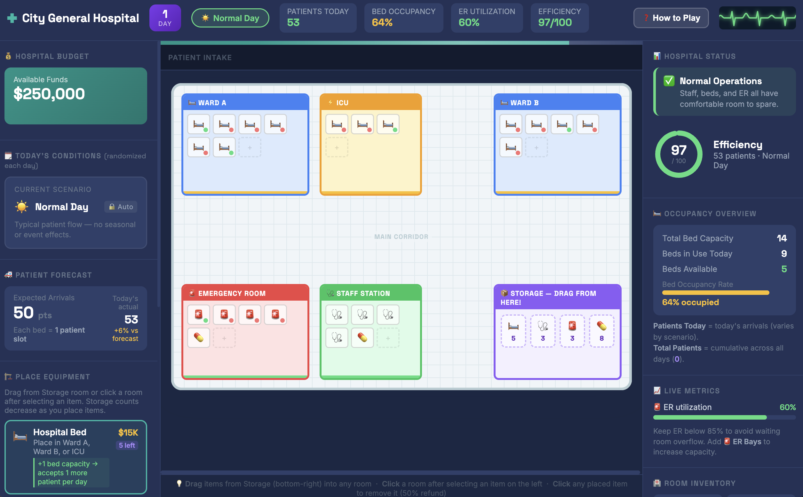
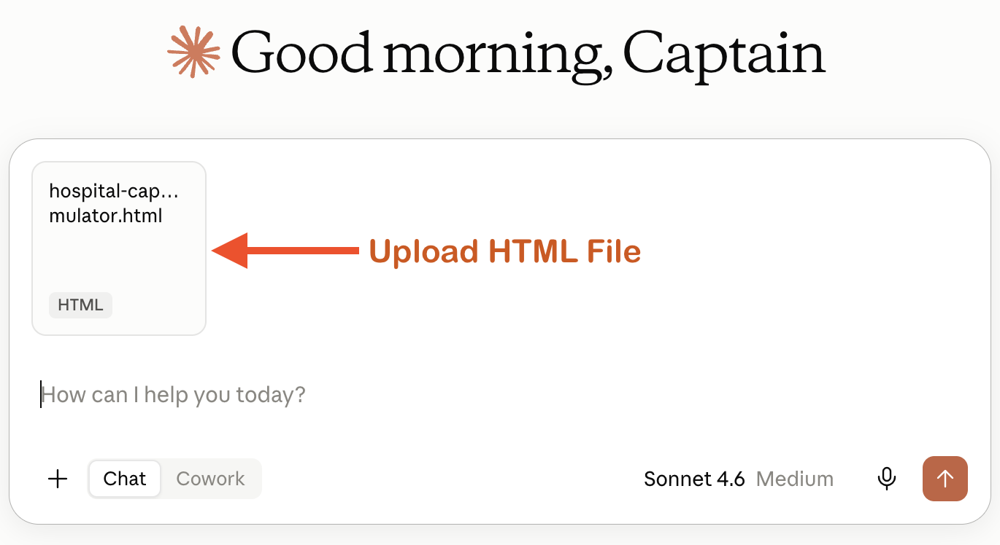

# Turn your Hospital Simulator into a Tycoon Style Game! 
 

Expanding on from the previous activity, let's make our simulator more engaging and interactive by turning it into a hospital management game inspired by games like RollerCoaster Tycoon.

Instead of mainly adjusting sliders and looking at numbers, you'll be able to visually manage your hospital by placing and moving resources such as beds, staff, and equipment.

Here's an example of a Hospital Capacity Tycoon game created with this approach using Claude: [Hospital Tycoon](https://mahumahmed.github.io/hospital-capacity-simulator/hospital-tycoon/){:target="_blank"}. 

You can use any Generative AI tool for this activity, but for coding I'd recommend using Anthropic's [Claude](https://claude.ai/){:target="_blank"}, as the free version creates more visually attractive web applications by default. Alternatively, you can use [Google Gemini](https://gemini.google.com/){:target="_blank"} (which comes free with Gmail), [ChatGPT](https://chatgpt.com/){:target="_blank"}, [Microsoft Copilot](https://copilot.microsoft.com/){:target="_blank"}, or any other GenAI tool that you are familiar with.

If you get stuck, please ask your instructor for assistance, and don't forget to have fun!

## Turn your simulator into a Tycoon-style game

Step 1
{: .label .label-step}
- Open the Hospital Capacity Simulator HTML file you created in the previous activity.
- Upload the HTML file to your GenAI tool. 
- You are going to ask the AI to keep the existing mechanics of your simulator while making the hospital more visual and interactive.



## Choose Your Approach

There are two ways you can approach this activity. Choose whichever works best for you!

### Option 1: Create a Plan

If you're not sure exactly how you want your game to work, you can start with a short prompt and let the AI ask you questions.

- Copy and paste the following prompt into your GenAI tool:
```
Please create a plan to update and improve this Hospital Capacity Simulator using game mechanics similar to RollerCoaster Tycoon. Keep the variables
and mechanics already in the game, but add a budget and a way for the game to progress over time. Ask me any questions that will assist in creating the game. 
```

- Answer any questions that your GenAI tool asks and use the conversation to develop your game.
- Once you are happy with the plan, ask the AI to make the changes to your HTML file.

### Option 2: Use a Detailed Prompt

If you already have a good idea of what you want your game to look like, you can give the AI more specific instructions from the start.

- For example, here is a more detailed prompt you could copy and paste into your GenAI tool:
  
```
I have attached my Hospital Capacity Simulator HTML file. Keep the existing game mechanics,
variables, and resource-management systems, but make it more
visual and interactive, like a RollerCoaster Tycoon-style management game.

Make the hospital layout the main interface. Show hospital rooms, beds,
staff, equipment, and storage, and allow the player to drag and drop resources into the hospital.

Add a hospital budget that the player must manage. Placing or purchasing beds,
staff, equipment, and other resources should cost money and update the budget.

Make the game progress one day at a time. The player should make management
decisions during the current day, then click a "Run Simulation" or "End Day" button
to simulate that day. Once the simulation finishes, advance to the next day and
update the hospital's patients, finances, conditions, and performance based on the player's decisions.

Make the visual hospital and the existing simulation work together, so that placing resources
affects the existing hospital metrics and game outcomes. Clearly display the current day,
budget, hospital resources, and important performance metrics.

Make the game easy to understand and visually engaging, while keeping everything in a single HTML file.
```
{: .step}

Step 3
{: .label .label-step}
- Next we need to wait a minute or two for the AI to modify your HTML file.
- If you are using Claude, it will display a preview of the updated webpage once it finishes. Before downloading, review the preview and make sure the changes are working as expected.
- Once it’s finished, click the **Download** button.
- Open the file in your browser and **play your game!** Try dragging resources into the hospital and see whether your actions affect the simulation.
{: .step}

## Improve your game with follow-up prompts

Step 4
{: .label .label-step}
- Your first version may not work exactly as expected. You may notice that something is confusing, doesn't work, or could be improved. This is normal!
- This is where **iterating** becomes important. Test your simulator, identify a problem, and ask the AI to fix it.
- It can sometimes be difficult to identify issues on your own, so if possible, have someone else test the game for you and get them to jot down notes 
- For example here are some of the following follow-up prompts you could ask if you come across similar issues:
  
```
Can you add a simple How to Play or Instructions page
that explains what I should do and what the different resources do?
```

```
Today's hospital condition should be randomly selected each day
and shouldn't be changeable by the player.
```

```
The number of patients seems much higher than the number of beds shown visually.
Can you suggest a more realistic way to represent this?
```

{: .step}

Step 5
{: .label .label-step}
- Continue testing your game and asking the AI to make improvements.
- You don't need to use the follow-up prompts above. You can also write your own prompts based on the problems you notice while playing.
- Remember, **you don't have to get everything right in your first prompt.** Vibe coding involves creating something, testing it, finding problems, and asking AI to help you improve it.
- Keep this process in mind whenever you use GenAI for coding:
**Create → Test → Find a problem → Ask AI to fix it → Test again**

{: .step}

Step 6
{: .label .label-step}
- If you're having trouble getting the game you want, that's okay! Take a look at the following example and identify any features it has that you would like to add to your own game. You can simply make a list of the features you want and ask your AI to add them: [Hospital Tycoon](https://mahumahmed.github.io/hospital-capacity-simulator/hospital-tycoon){:target="_blank"}.

{: .step}

Step 7 (optional)
{: .label .label-step}
- If you'd like to share your game to the world, you can publish it for free with GitHub Pages:
  * Create a free account at [github.com](https://github.com/) if you don't already have one.
  * Create a new **public** repository, for example one called "hospital-simulator".
  * Upload your HTML file to the repository and rename it **index.html**.
  * In your repository go to **Settings**, then **Pages**, and under **Branch** select **main** and click **Save**.
  * After a minute or two your app will be live at: `https://YOUR-USERNAME.github.io/hospital-tycoon/`

{: .step}


Congratulations on completing this vibe code project!

[NEXT STEP: Counting Game](8-counting-game.html){: .btn .btn-blue }
