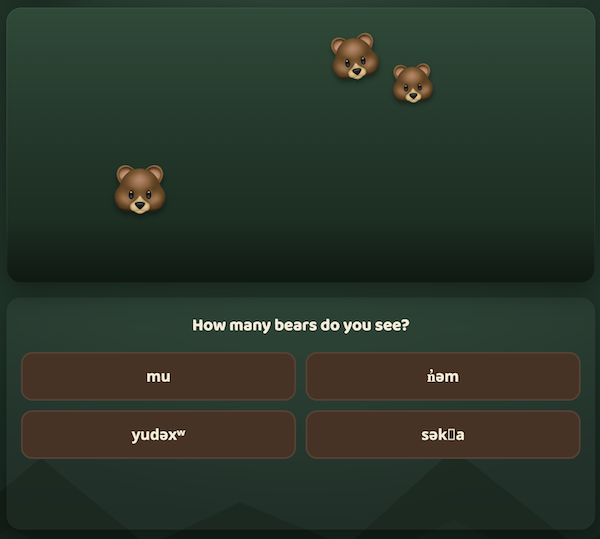
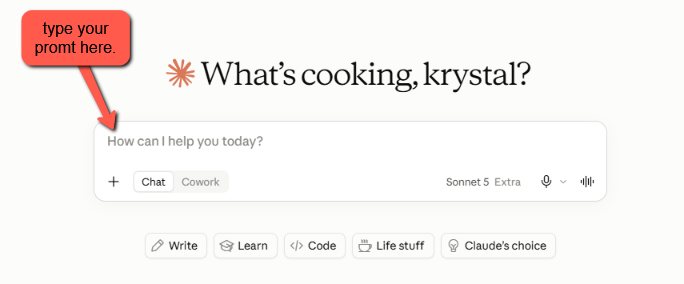
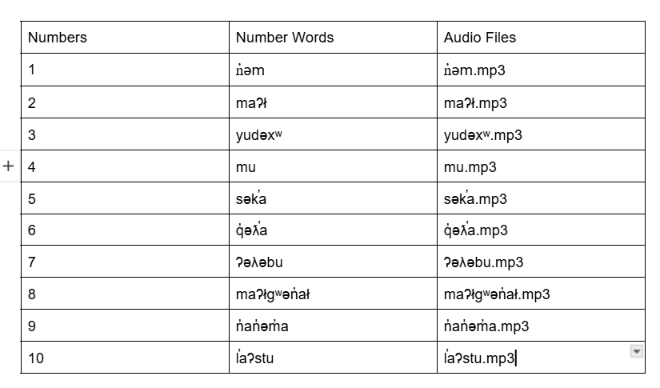
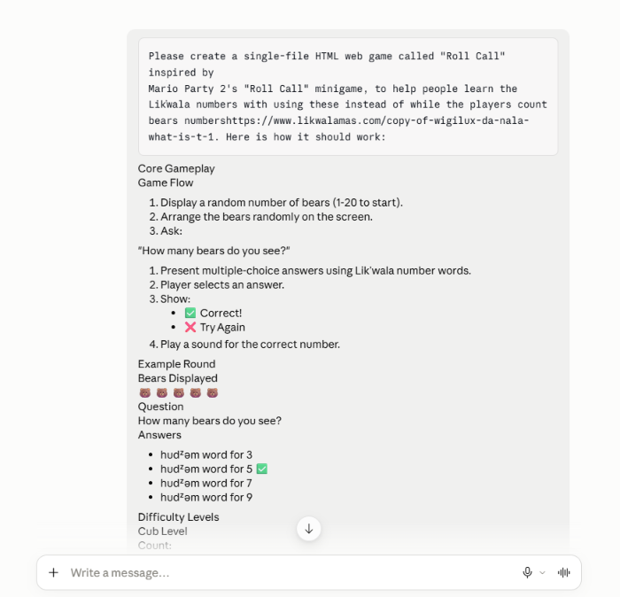
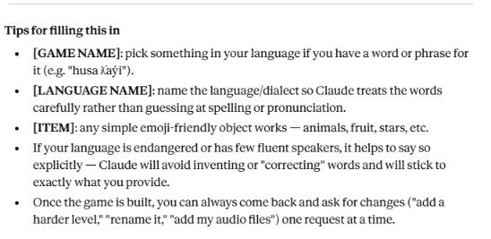
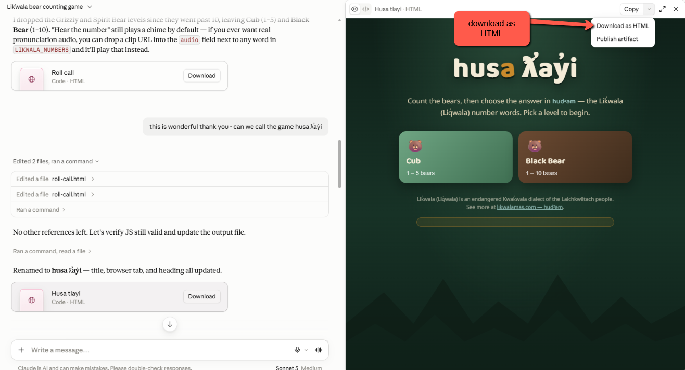
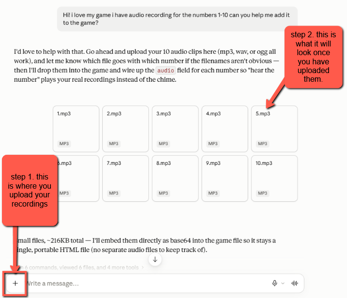
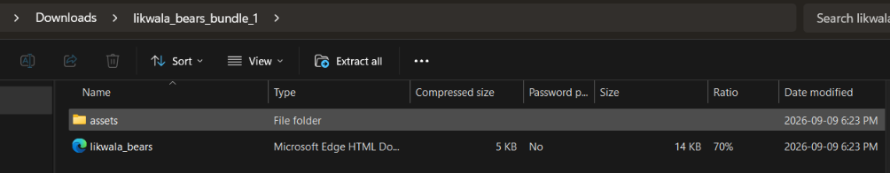

# !!! UNDER CONSTRUCTION !!!
# Make a Lik̓wala Counting Game in 15-Minutes!
 

Counting games are a wonderful way for language learners to practise number words with as much repetition as they need, at their own pace, and with a bit of playful competition thrown in. Here's an example of a counting game created for Language Revitalization purposes: [husa ƛ̕ay̓i, a Lik̓wala Bear Counting Game](https://krystalhenkel.github.io/learninggames/husatlayi.html). In the game, learners count the bears on the screen, choose the correct number word in Lik̓wala, and hear the word spoken aloud.

Feel free to create a counting game for any language you want during this activity. If you don't yet have audio recordings of the number words, don't worry, the game will still work without sound, and you can add the recordings later (see the [Recording Audio activity](20-audio-recording.html) for how to make them).

By the end of this activity you will be able to:

- Gather and verify a short list of number words in a word processor before handing them to a GenAI tool.
- Write a prompt that describes a counting game clearly enough for a GenAI tool to build it in a single HTML file.
- Test the game, ask for changes, and add audio files.
- Publish your game for free on GitHub Pages (optional).

If you get stuck, please ask your instructor for assistance, and don't forget to have fun!

## Step 1

- You can use any Generative AI tool for this activity, but for coding I'd recommend using Anthropic's [Claude](https://claude.ai/), as the free version creates more visually attractive web applications by default. Alternatively, you can use [Google Gemini](https://gemini.google.com/) (which comes free with Gmail), [ChatGPT](https://chatgpt.com/), [Microsoft Copilot](https://copilot.microsoft.com/), or any other GenAI tool that you are familiar with.




## Step 2

- Before we ask the AI to build anything, we need the number words. GenAI tools are not reliable sources for endangered language vocabulary, so please get the words from a fluent speaker, a community language site such as [likwalamas.com](https://www.likwalamas.com/), or a dictionary you trust.
- Open a word processor (Google Docs or Word both work well) and make a simple two-column table with the numbers 1 to 10 in the first column and the number word in the second column. If you have audio files, add a third column with the filename for each word (all lowercase, no spaces, for example `1.mp3`).
- If you are working with a language that uses special characters (like the ƛ̕ and y̓ in Lik̓wala), make sure they display correctly in your document. If they look right here, they will look right in your game.
  

## Step 3

- Copy and paste the following prompt into your GenAI tool, then paste your table of number words underneath it, and press **Enter** on your keyboard. Feel free to change the animal, the language, or the number of levels!

```
Please create a single-file HTML web game called "[GAME NAME]" inspired by Mario Party 2's "Roll Call" minigame, to help people learn the [LANGUAGE NAME] numbers 1–10.

How it should work:

Display a random number of [ITEM, e.g. bears/apples/stars] (1–10), scattered on screen with slight overlap allowed, like Mario Party's Roll Call bears rolling in.
Ask: "How many [ITEM] do you see?"
Show 4 multiple-choice answers using the [LANGUAGE NAME] number words (one correct, three distractors).
On selection: show ✅ Correct! or ❌ Try Again.
After a correct answer, play a sound for that number.

Difficulty levels:

[Level 1 name] — 1 to [N] [ITEM]
[Level 2 name] — 1 to [N] [ITEM] (add more levels if you want a wider range than 1–10)

Number words: Please do NOT guess or invent the words — leave them as clearly labeled placeholders in the code for me to fill in myself, since I want to supply verified words from a fluent speaker or trusted source. I will provide: 1 is [WORD FOR 1] 2 is [WORD FOR 2] 3 is [WORD FOR 3] 4 is [WORD FOR 4] 5 is [WORD FOR 5] 6 is [WORD FOR 6] 7 is [WORD FOR 7] 8 is [WORD FOR 8] 9 is [WORD FOR 9] 10 is [WORD FOR 10]

Audio: I may upload 10 short audio recordings (one per number) afterward. When I do, please embed them directly in the HTML file (so it stays one portable file), and use them instead of any placeholder sound. Please use Blob URLs rather than playing long data: URIs directly through the Audio object, since that's unreliable on some browsers (notably Safari/iOS).
```
-  Here is an example of the kind of game we are aiming for: [husa ƛ̕ay̓i Bear Counting Game][(https://krystalhenkel.github.io/learninggames/husatlayi.html)]

- Here is an example I wrote for Claude to understand the language I wanted to use. This will help with the audio upload later.
- 
> **Screenshot prompt for images/counting-03.png:** Capture the Claude chat window with the full prompt pasted in and the number word table visible just below it. Draw a red rectangle around the pasted table and add a callout that reads "Paste your table here." Add a second callout with an arrow pointing to the send button.
> 
 
## Step 4

- Now we wait a minute or two for the AI to create the HTML file for you. While it works, you can watch it write the code.
- If you are using Claude, it will display a preview of the game on the right side of the screen once it has generated the file. Try playing a few rounds in the preview! Check that the number words are spelled exactly as they appear in your table, since this is the most common thing that needs fixing.
- Once you are happy with it, click the **Download** button and make note of where you saved the file on your laptop (usually your Downloads folder).

 

> **Screenshot prompt for images/counting-04.png:** Capture the Claude interface with the game preview open on the right showing the level selection screen. Draw a red rectangle around the Download button in the top right of the preview pane and add a callout labelled "Download your game." Add a second, smaller callout pointing at one of the number words in the preview that reads "Check spelling against your table."

## Step 5

-Now you can upload ten mp3 clips, one per number. Claude will then put them directly inside the HTML file (as base64 data) so the whole game stays one single, portable file with no separate audio files to lose track of, and will wire each clip to its matching number. Example: for the #1 
- If you don't have recordings yet, that's fine. Skip this step for now and come back to it after the [Recording Audio activity](20-audio-recording.html). The game will work without sound.


 


> **Screenshot prompt for images/counting-05.png:** Capture a Finder or File Explorer window showing the downloaded HTML file next to a folder named "assets," with the assets folder open in a second pane showing files 1.mp3 through 10.mp3. Draw a red rectangle around the assets folder and add a callout reading "Folder name and filenames must match your prompt exactly."

## Step 6

- **Double-click** the HTML file to open it in your web browser and play a few rounds of your game.
- If you created your game in Claude, [it should look something like this]([https://krystalhenkel.github.io/learninggames/husatlayi.html])
- If the sounds are not playing, the most likely causes are a filename that doesn't match (check for capital letters or spaces) or the assets folder being in the wrong place. If you are having any problems, please let your instructor know and they will help you get your game up and running!


> **Screenshot prompt for images/counting-06.png:** Capture the game in a browser mid-round, with several bear emoji visible and the four answer buttons showing number words. Add three numbered callouts: "1" pointing to the score and streak display, "2" pointing to the answer buttons, and "3" pointing to the "Hear it again" button.

## Step 7

- Now let's make the game your own. Go back to your GenAI tool and ask for a change. Here are a few prompts to try (one at a time works best):

```
Add a third level called "Grizzly" with 1 to 20 bears, and arrange the bears in rows
of five so they are easier to count.
```

```
Add a timer option so the player can choose to have 10 seconds to answer each round,
and show a best streak that is saved in the browser so it is still there next time.
```

```
Change the bears to salmon and update the title and the question to match.
```

- After each change, check the preview, then download the file again. It's a good idea to keep the older version until you are sure the new one works.


> **Screenshot prompt for images/counting-07.png:** Capture the chat with the "Grizzly level" follow-up prompt visible and the preview on the right now showing three level buttons. Draw a red rectangle around the new third level button and add a callout reading "New level added."

## Step 8

- **Optional:** Share your game with the world by publishing it for free on GitHub Pages. If you have a GitHub account:
  * Create a new public repository and upload your HTML file and your assets folder (you may want to rename the HTML file to `index.html`).
  * In the repository, go to **Settings**, then **Pages**, and under **Branch** select **main**, then click **Save**.
  * After a minute or two your game will be live at `https://your-username.github.io/your-repository/`.
- If you'd like a walkthrough of this process, ask your instructor or your GenAI tool for step-by-step GitHub Pages publishing instructions.
- Here is an example on how to publish your file:

  <details markdown="1">
  <summary>Show/Hide Animation</summary>

  

  </details>


> **Screenshot prompt for images/counting-08.png:** Capture the GitHub repository Settings > Pages screen. Draw red rectangles around the Branch dropdown (set to "main") and the Save button, and add a callout at the top reading "Your game will be live in a minute or two." Blur the username if you prefer not to show it.

## Stretch Activities

- Ask the AI to add a "practice mode" where the game says the number word first and the learner taps the group with the matching number of bears. This flips the game from reading to listening.
- Ask for a simple results screen at the end of ten rounds that shows which numbers the learner got right and wrong most often.
- Try building the same game for a second language. Because the structure is the same, you'll be surprised how quickly it comes together the second time :-)

## A Note on Language, Audio, and Privacy

- Please only use recordings that you have permission to share. If a community member recorded the number words for you, ask them how they would like to be credited and whether they are comfortable with the game being published publicly.
- GenAI tools sometimes "helpfully" invent vocabulary. Always check the words in your finished game against your original table, and ask a speaker to review the game before sharing it widely.
- Nothing about the learner is sent anywhere by this game. If you add the "best streak" feature, that number is stored only in the learner's own browser.

---

Congratulations on completing this Counting Game vibe code project! You now have a small, working language learning tool that you built yourself, and a pattern you can reuse for colours, animals, or any other set of words worth practising. Here's the example that inspired this activity: [husa ƛ̕ay̓i, a Lik̓wala Bear Counting Game](https://krystalhenkel.github.io/learninggames/husa-tlayi.html).

[NEXT STEP: Recording Alphabet Audio](20-audio-recording.html)
