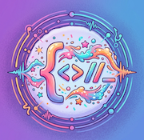

# UNDER CONSTRUCTION
# From Ideas to Apps: Create Apps & Learning Games with Generative AI

- Pre-workshop activities: 10 min 
- Introductory presentation: 15 min
- Hands-on activities: 50-70 min

## Why Should I Learn to Create Apps with GenAI? 

Imagine bringing your ideas for custom apps and learning games to life without ever writing a single line of code. This hands-on workshop introduces you to the world of "vibe coding, "a modern software development technique where your natural language descriptions are transformed into fully functional web applications using generative AI tools. Vibe coding allows you can shift your focus entirely to creative design and rapid prototyping. Whether you are an educator aiming to build custom learning resources or a student looking to develop a personal project, this workshop lowers the barriers software creation, giving you the digital agency to build tailor-made web tools from scratch in a matter of minutes.

Join us in moving from a consumer of digital technology to an active creator, and walk away with the practical skills and confidence to turn your ideas into reality.

## Learning objectives

At the end of this workshop, you will be able to:

1. Explain the main benefits of vibe coding to a friend
2. Explain common security issues that arise from vibe coding
3. Create one or more of the following games or web applications:
   - Create a sound board game for language revitalization or language learning
   - Create a endless runner "Super Maria" style game for learning
   - Create a missle command style game for language revitalization
   - Craete a frogger style game for learning
   - Create a simulation for learning about things like Volcao erruptions
   - Create a quize game for reviewing unit information
   - Create a jeapordy style game for playing in group settings
   - Create a training app for preparing for an upcoming sporting event like a bike ride or marathon
   - Create a Super Mario style game for learning
   - Create a Pandemic style game for learning about epedemiology
4. OPTIONAL: Create a free GitHub Pages website so that you have a place to make you games available to other people
5. Make one or more web apps usable on mobile devices in addition to laptops
6. Make one or more games usable offline (with no internet connection)
7. Demonstrate the use of effective game mechanics in one or more games
8. Use Desing Thinking techniques to help design an effective educational game or web application

## Hands on Activities

3. ~~Alphabet Sound board learning game~~
4. Eco Runner: Auto-Run style environmental conservation themed game (pick up garbage & save the environment)
5. Lik'wala Defender language lerning game: https://richmccue.github.io/likwala/likwala-defender.html
6. Frogger Style learning game: **create?**
7. Volcanic erruption simulator: https://richmccue.github.io/learning-games/volcano-phases.html
8. Quiz game with a downloadable badge: https://richmccue.github.io/learning-games/phone_listening_quiz.html 
9. Jeapordy game: https://richmccue.github.io/learning-games/jeopardy.html
   - Start w/ dosument or topic in NotebookLM and create categories & questions
   - Feed into Claude or Gemini to create the game
10. Tour de Victoria training app: https://richmccue.github.io/
   - Stand alone with data store in browser, on device
   - with completely insecure data storage on Github
11. Super Mario Learning game:  **create?**
12. Pandemic Style game:  **create?**
 
[NEXT STEP: Pre-Workshop Activities](pre-workshop.html){: .btn .btn-blue }
